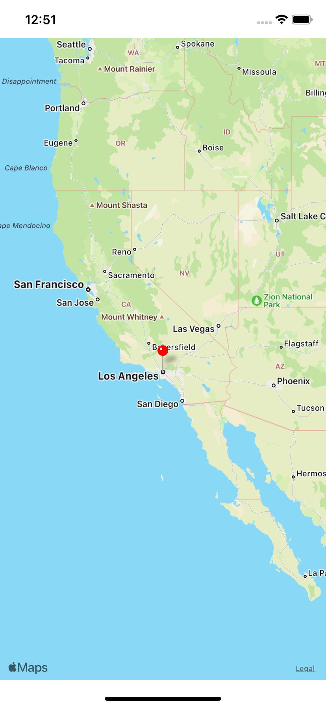
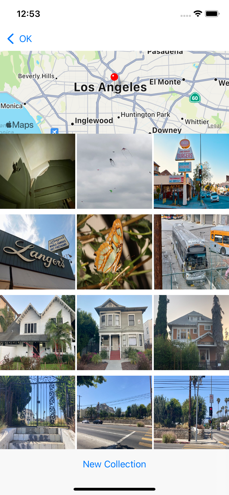

# Virtual-Tourist
This is an iOS app that lets users specify travel locations around the world and create virtual photo albums for each location.
The locations and photo albums are stored in Core Data.

# Getting Started
Make sure that you have the latest version of Xcode and Swift installed. After cloning/downloading the project, run it in 
your version of Xcode using the device simulator of your choice.

# Using The App
## Travel Locations Map

  

When the app first starts it will open to the map view. Users can zoom and scroll around the map using standard pinch 
and drag gestures. The center of the map and the zoom level are persistent in that if the app is turned off, the map returns 
to the same state when it is turned on again. Tapping and holding the map drops a new pin. Users can place any number of pins on 
the map. When a pin is tapped, the app will navigate to the Photo Album view associated with the pin.

## Photo Album

  

If the user taps a pin that does not yet have a photo album, the app will download Flickr images associated with the latitude and 
longitude of the pin. If no images are found a “No Images” label will be displayed. If there are images, then they will be displayed 
in a collection view. While the images are downloading, the photo album is in a temporary “downloading” state in which the New 
Collection button is disabled. The app determines how many images are available for the pin location, and displays a placeholder 
image for each. Once the images have all been downloaded, the New Collection button at the bottom of the page is enabled. 
Tapping this button empties the photo album and fetches a new set of images. Users can remove photos from an album 
by tapping them. Pictures will flow up to fill the space vacated by the removed photo. All changes to the photo album are automatically 
made persistent. If the user selects a pin that already has a photo album then the album is displayed and the New Collection button is 
enabled. Tapping the back button returns the user to the Map view.

# Special Notes
* Make sure to long press on the map to place a pin at a certain location.
* In locations that have a fairly static set of Flickr images, “new” images might overlap with previous collections of images.
